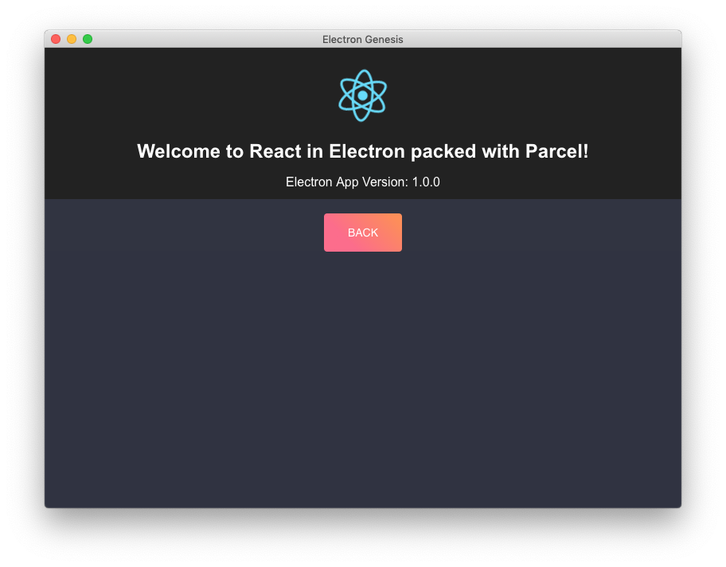

<!-- @format -->

# Electron Genesis ✨

[](https://travis-ci.org/mozillasecurity/electron-genesis)
[](https://david-dm.org/mozillasecurity/electron-genesis)
[](https://david-dm.org/mozillasecurity/electron-genesis.svg?style=flat-square?type=dev)

Electron and essentials to get you started writing cross platform desktop apps in no time based on [Electron](https://electronjs.org/), [React](https://reactjs.org/), [React Router](https://github.com/ReactTraining/react-router), [Styled Components](https://www.styled-components.com/), [Material UI](https://material-ui.com), [Jest](https://jestjs.io) and [Parcel](https://parceljs.org/).
It offers a carefully selected range of packages and configurations to setup a featured development environment and a production ready build.

## Reasons

At the time of diving into Electron and using React as UI library for a new project I was unable to find a boilerplate which implemented Electron and Jest or tests in general. There was only a handful of boilerplates which were actually suitable to built on for production ready apps. Most noteable the boilerplates from `chentsulin`, `electron-forge` and extending - by forking or re-wireing - `react-scripts` from Facebook's `create-react-app`. Long story short, at the end my needs and wishes outweighted the work put into extending `react-scripts` and possibly maintaing the fork in the future that I decided to not get bald and to write my own custom boilerplate based on my wishes and the trends I observed in the community.



## Overview

- [Usage](#Usage)
- [Commands](#Commands)
- [Packages Overview](#Packages-Overview)
- [Code Quality](#ESLint,-Flow-and-Prettier-Integration)
- [VSCode Integration](#SCode-Integration)
  - [Recommended VSCode Extensions](#Recommended-VSCode-Extensions)
- [Issues](#Issues)

## Usage

The project recommends `yarn`. If you have not installed `yarn` follow the individual platform instructions [here](https://yarnpkg.com/en/docs/install). For MacOS it is as easy as running `brew install yarn`.

```
git clone --depth=1 https://github.com/mozillasecurity/electron-genesis <project-name>
cd <project-name>
yarn install
```

You have now successfully checked-out the base for your new project. To run the development version use `yarn start` and to produce a production build run `yarn dist`.

## Commands

For a detailed list of commands take a look into the `scripts` section of `package.json`.

### Development

```
yarn start

yarn test
yarn typecheck
yarn lint
yarn format
yarn docs

yarn updates
```

### Production

```
yarn dist
```

## Packages Overview

| Component     | Package                               | Dependency | Description                             |
| ------------- | ------------------------------------- | ---------- | --------------------------------------- |
| App           | electron                              |            |                                         |
|               | cross-env                             | 🔧         | Sets env vars cross platform            |
|               | electron-log                          |            |                                         |
|               | electron-devtools-installer           |            |                                         |
|               | electron-builder                      | 🔧         |                                         |
|               | electron-updater                      |            |                                         |
|               | express                               | 🔧         | Workaround for Parcel                   |
|               | app-root-path                         |            |                                         |
|               | dotenv                                |            | Env Configuration                       |
|               | dotenv-expand                         |            | Env Configuration                       |
| UI            | react                                 |            | UI Library                              |
|               | react-dom                             |            | UI Library                              |
|               | react-router-dom                      |            | UI Navigation                           |
| Style         | styled-components                     |            | Styled Components (CSSJS)               |
|               | styled-theming                        |            | Styled Components Theming               |
|               | @material-ui/core                     |            | Material UI core                        |
|               | typeface-roboto                       |            | default font for Material UI            |
|               | @material-ui/icons                    |            | default icons for Material UI           |
| Transpiling   | babel-cli                             | 🔧         |                                         |
|               | babel-core                            | 🔧         |                                         |
|               | babel-eslint                          | 🔧         |                                         |
|               | babel-jest                            | 🔧         |                                         |
|               | babel-plugin-styled-components        | 🔧         |                                         |
|               | babel-preset-env                      | 🔧         |                                         |
|               | babel-preset-flow                     | 🔧         |                                         |
|               | babel-preset-react                    | 🔧         |                                         |
|               | babel-preset-stage-2                  | 🔧         |                                         |
| Type Safety   | flow-bin                              | 🔧         | TypeScript alternative                  |
|               | flow-upgrade                          | 🔧         |                                         |
|               | flow-typed                            | 🔧         |                                         |
|               | flow-coverage-report                  | 🔧         |                                         |
| Testing       | jest                                  | 🔧         | Testing framework                       |
|               | jest-config                           | 🔧         | Jest configuration support              |
|               | @jest-runner/electron                 | 🔧         | To run tests inside Electron            |
|               | react-test-renderer                   | 🔧         |                                         |
|               | regenerator-runtime                   | 🔧         |                                         |
|               | spectron                              | 🔧         |                                         |
| Linting       | eslint                                | 🔧         | For JS/JSX                              |
|               | eslint-plugin-flowtype                | 🔧         |                                         |
|               | eslint-plugin-import                  | 🔧         | Linting of ES6+ import/export syntax    |
|               | eslint-plugin-jsx-a11y                | 🔧         |                                         |
|               | eslint-plugin-react                   | 🔧         | React specific linting rules for ESLint |
|               | stylelint                             | 🔧         | CSSJS                                   |
|               | stylelint-config-prettier             | 🔧         |                                         |
|               | stylelint-config-recommended          | 🔧         |                                         |
|               | stylelint-config-styled-components    | 🔧         |                                         |
|               | stylelint-processor-styled-components | 🔧         |                                         |
| Formatting    | prettier                              | 🔧         |                                         |
|               | prettier-eslint                       | 🔧         |                                         |
|               | prettier-eslint-cli                   | 🔧         |                                         |
|               | eslint-config-prettier                | 🔧         |                                         |
|               | eslint-plugin-prettier                | 🔧         |                                         |
|               | lint-staged                           | 🔧         | In combination with Husky               |
|               | husky                                 | 🔧         | Run Git hooks                           |
| Documentation | esdoc                                 | 🔧         | Documentation generator                 |
|               | esdoc-standard-plugin                 | 🔧         |                                         |
|               | esdoc-jsx-plugin                      | 🔧         |                                         |
|               | esdoc-node                            | 🔧         |                                         |
| Utilities     | npm-check-updates                     | 🔧         | Checks package dependency updates       |
|               | npm-run-all                           | 🔧         | Runs scripts in parallel or sync        |
|               | parcel-bundler                        | 🔧         | Zero conf Webpack replacement           |

Dev-Dependency: 🔧

## ESLint, Flow and Prettier Integration

### Linting

- ESLint will check JS/JSX for correctness.
- Styleint and the attached processor extract the CSS out of Styled-Components to check it for correctness.

### Type Checking

- Flow will check JS/JSX code for type-safety.

### Formatting

- Prettier is an opinionated formatter and will format the style for multiple filetypes automatically.

## VSCode Integration

This package comes with a `.vscode/settings.json` workspace configuration file and set recommended values.

### Recommended VSCode Extensions

Recommended to get the most out of this package. The configurations already exist in this package if you choose to use VSCode for development.

- [Prettier](https://marketplace.visualstudio.com/items?itemName=esbenp.prettier-vscode)
- [ESLint](https://marketplace.visualstudio.com/items?itemName=dbaeumer.vscode-eslint)
- [Flow Language Support](https://marketplace.visualstudio.com/items?itemName=flowtype.flow-for-vscode)
- [Stylelint](https://marketplace.visualstudio.com/items?itemName=shinnn.stylelint)

Optionally

- [Debugger for Chrome](https://marketplace.visualstudio.com/items?itemName=msjsdiag.debugger-for-chrome)
- [yarn](https://marketplace.visualstudio.com/items?itemName=gamunu.vscode-yarn)
- [Version Lens](https://marketplace.visualstudio.com/items?itemName=pflannery.vscode-versionlens)
- [Import Cost](https://marketplace.visualstudio.com/items?itemName=wix.vscode-import-cost)
- [Jest](https://marketplace.visualstudio.com/items?itemName=Orta.vscode-jest)

## 🙈 Issues

- #### Babel 7

  As soon as Parcel adds support for Babel 7, the Babel dependencies can be upgraded to use scopes. See also the [Babel 7 migration guide](https://babeljs.io/docs/en/v7-migration) for other changes required and the Parcel WIP [issue](https://github.com/parcel-bundler/parcel/issues/868)

  ```
  "@babel/cli": "^7.0.0",
  "@babel/core": "^7.0.0",
  "@babel/preset-env": "^7.0.0",
  "@babel/preset-flow": "^7.0.0",
  "@babel/preset-react": "^7.0.0",
  "@babel/preset-stage-2": "^7.0.0",
  ```

- #### Flow LSP

  Running flow through the `Language Server Protocol` is still experimental.

  ```
  "flow.useLSP": true
  ```

- #### vscode-jest & jest-runner/electron

  Does not always play nicely together for unknown reasons which it is a known issue.

  ```
  node_modules/@jest-runner/electron/build/electron_process_injected_code.js:25
  _electron.app.on('ready', async () => {
              ^
  TypeError: Cannot read property 'on' of undefined
  ```

- #### prettier-stylint and styled-components

  It was unsuccessful to get `prettier-stylint` to format and to `--fix` CSS inside `styled-comonents`.
  Prettier has built-in support now for `styled-components` but does not do any linting.
